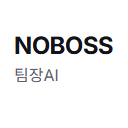
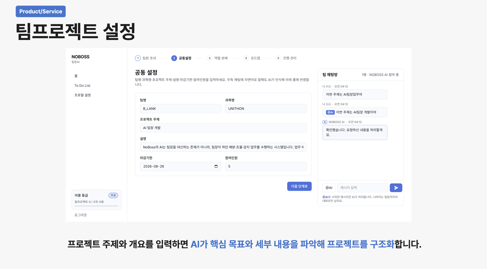
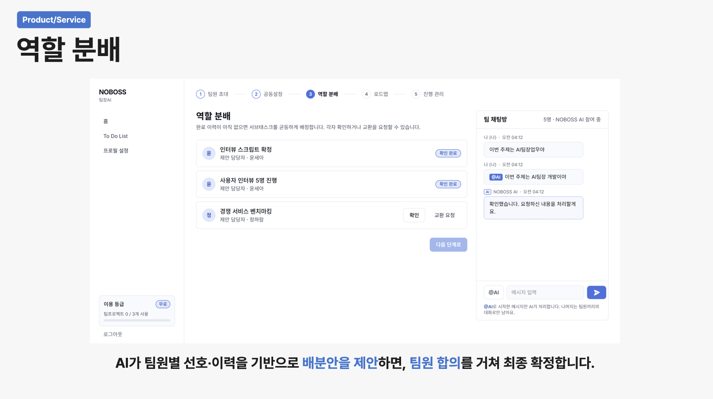
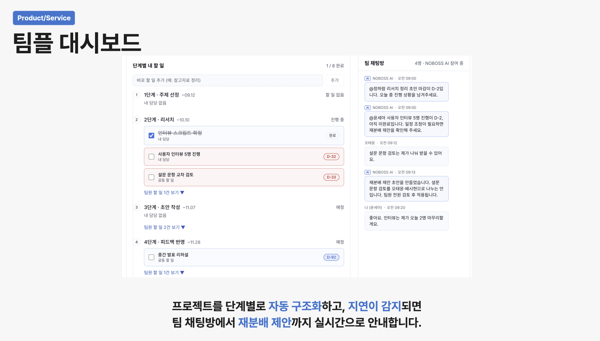
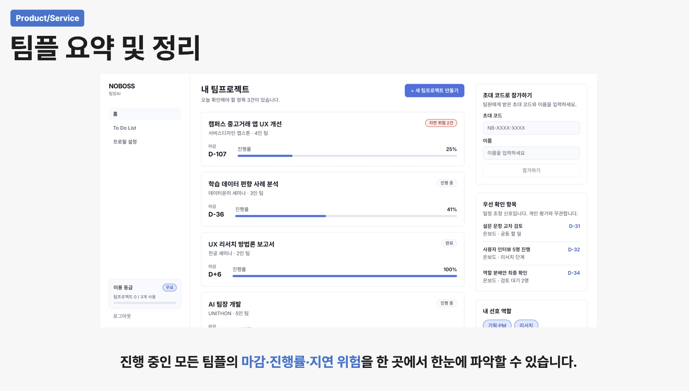
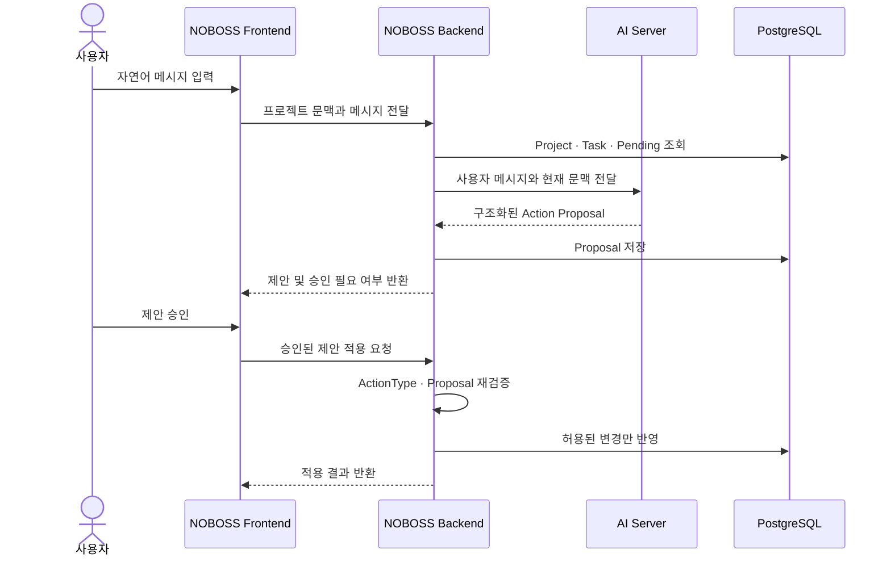

<div align="center">



# NOBOSS

### 독촉하는 사람 없이 굴러가는 팀플

> 팀 프로젝트 설정부터 역할 분배, 진행 관리, 최종 정리까지<br />
> AI와 함께 효율적으로 운영하는 팀 프로젝트 협업 서비스

<a href="https://noboss-fe.vercel.app/">
  
</a>
<a href="https://noboss-api.kusitms.xyz/swagger-ui/index.html">
  
</a>

</div>

---

## 💡 NOBOSS가 해결하는 문제

팀 프로젝트에서는 역할과 일정이 계속 바뀌지만, 이를 정리하고 독촉하는 일은 특정 팀원에게 집중됩니다.

NOBOSS는 프로젝트 문맥을 이해하는 AI를 통해 반복되는 관리 업무를 줄이고, 팀원이 실제 작업과 의사결정에 집중할 수 있도록 돕습니다.

- 자연어로 프로젝트와 업무를 입력
- AI가 역할과 단계별 할 일을 구조화
- 마감 임박 업무와 진행 상황을 한눈에 확인
- AI 변경 제안은 사용자가 승인한 경우에만 반영

> AI가 임의로 데이터를 변경하지 않습니다. 모든 변경은 구조화된 제안과 사용자의 승인 이후에 실행됩니다.

<br />

## 📱 주요 기능

### 1. ⚙️ 팀 프로젝트 설정



<br />

### 2. 👥 역할 분배



<br />

### 3. 📊 팀플 대시보드



<br />

### 4. 📝 팀플 요약 및 정리



<p align="center"><strong>진행 중인 모든 팀플의 마감·진행률·지연 위험을 한 곳에서 한눈에 파악할 수 있습니다.</strong></p>

<br />

## 🤖 자연어 기반 프로젝트 관리

```text
사용자
"다음 주 금요일까지 사용자 인터뷰 5명 해야 해"
        ↓
AI
Task 생성에 필요한 단계 · 담당자 · 마감일 추출
        ↓
사용자
구조화된 변경 제안 확인 및 승인
        ↓
NOBOSS
백엔드 재검증 후 프로젝트에 반영
```

승인 대기 제안은 최신 1개만 유지합니다. 새로운 제안이 생성되면 직전 제안은 `SUPERSEDED` 상태가 되고, 최신 `PENDING` 제안만 승인할 수 있습니다.

<br />

## 🔧 AI 연동 구조



| 서버의 역할 | 설명 |
| --- | --- |
| 문맥 구성 | 현재 프로젝트, 전체 업무, 직전 대기 제안을 조회해 AI에 전달합니다. |
| 응답 검증 | AI 응답을 허용된 ActionType과 필수 필드로 검증합니다. |
| 안전한 실행 | 승인된 Proposal만 도메인 변경 메서드를 통해 반영합니다. |
| 중복 방지 | 메시지 잠금 조회로 동일 제안의 중복 반영을 방지합니다. |

<br />

## 🗂️ 프로젝트 둘러보기

| Repository | Description |
| --- | --- |
| [NoBoss-BE](https://github.com/NoBoss-team/NoBoss-BE) | Spring Boot 기반 백엔드 API와 AI Action 처리 |
| [NoBoss-FE](https://github.com/NoBoss-team/NoBoss-FE) | NoBoss 웹 프론트엔드 |
| [NoBoss-AI](https://github.com/NoBoss-team/NoBoss-AI) | 자연어 이해와 구조화된 Action Proposal 생성 |

### 주요 API

전체 요청·응답 스펙은 [Swagger API 명세](https://noboss-api.kusitms.xyz/swagger-ui/index.html)에서 확인할 수 있습니다.

```text
POST   /api/v1/projects
GET    /api/v1/projects/{projectId}
GET    /api/v1/projects/{projectId}/tasks
POST   /api/v1/projects/{projectId}/messages
POST   /api/v1/projects/{projectId}/messages/{messageId}/apply
```

<br />

## 👥 팀원

<table align="center">
  <tr>
    <th align="center">Backend</th>
    <th align="center">AI</th>
    <th align="center">Frontend</th>
  </tr>
  <tr>
    <td align="center"></td>
    <td align="center"></td>
    <td align="center"></td>
  </tr>
  <tr>
    <td align="center"><a href="https://github.com/kmg22">김민경</a></td>
    <td align="center"><a href="https://github.com/dddyoung2">김도영</a></td>
    <td align="center"><a href="https://github.com/sunwoo07">박선우</a></td>
  </tr>
</table>

<br />

<div align="center">

### 독촉은 줄이고, 협업은 선명하게.

</div>

<p align="center">
  <sub>Make it useful. Make it kind.</sub>
</p>